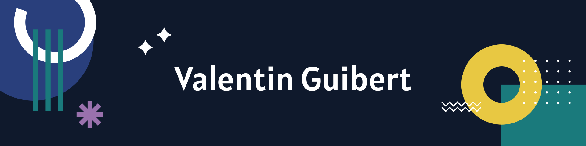

Hi there 👋

I’m Valentin, a full-stack engineer, creative coder and self-proclaimed designer.
I make it my mission to translate user-focused designs into pixel-perfect websites or applications that run blazing fast.

Want to know more about me? [Check out my portfolio.](https://valguibs.com/)

 

## 📌 Pinned Repositories

 

 
 

## &#x1f4c8; GitHub Stats

 

 
 

## 💼 Skills

 
 
 
 
 
 
 
 
 

 
 
