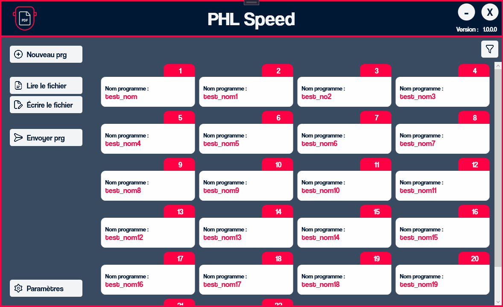
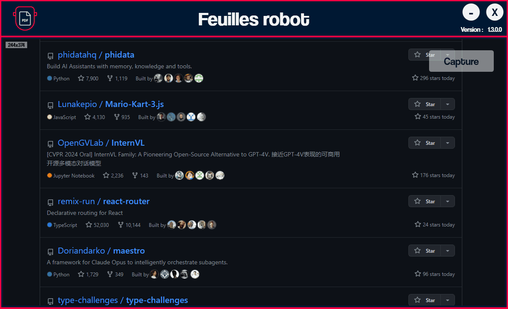

Hi there 

I’m Valentin, a full-stack engineer, creative coder and self-proclaimed designer.
I make it my mission to translate user-focused designs into pixel-perfect websites or applications that run blazing fast.

Want to know more about me? [Check out my portfolio.](https://valguibs.com/)

<!--
 

## 📌 Pinned Repositories

 

-->
 

## 💼 Skills

 
 
 
 
 
 
 
 
 
 

 

## 🛠️ Featured projects

<b>PHL Speed :</b> 
Gère un fichier de programmes CSV facilement, créer des programmes, envoie les programmes directement sur la station 

<b>Feuille robot :</b> 
Faire des captures d'écran puis créer un PDF sur mesure pour la production 

More and more...

 

## &#x1f4c8; GitHub Stats

 

<!--

-->

 
 
